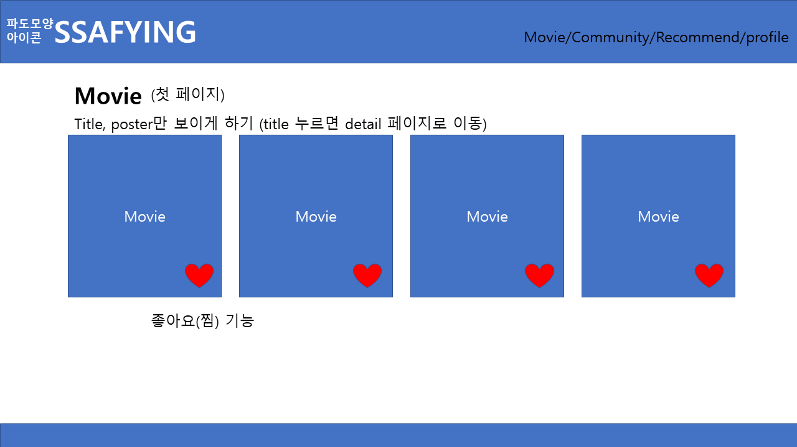
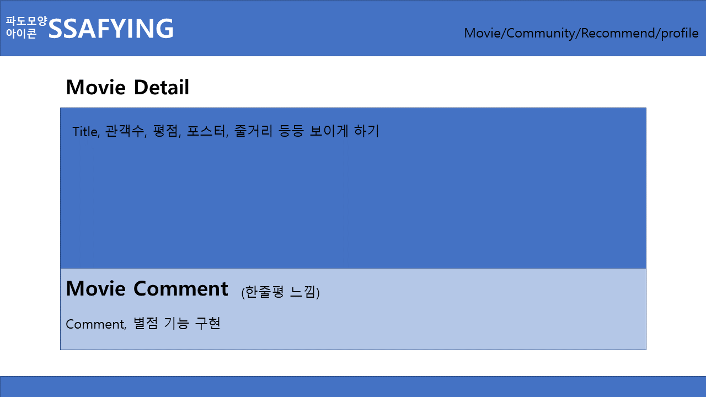
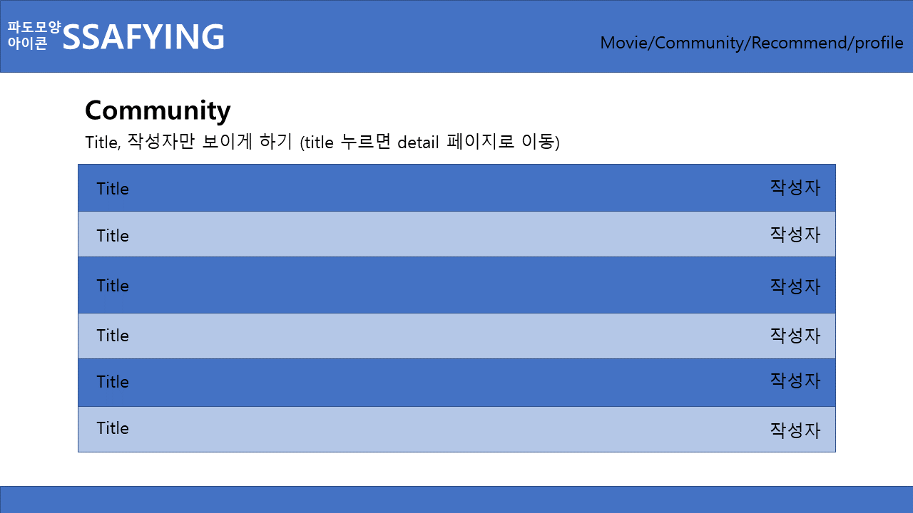
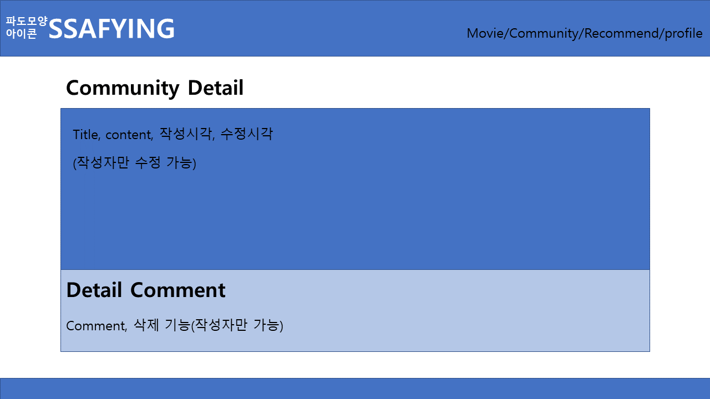
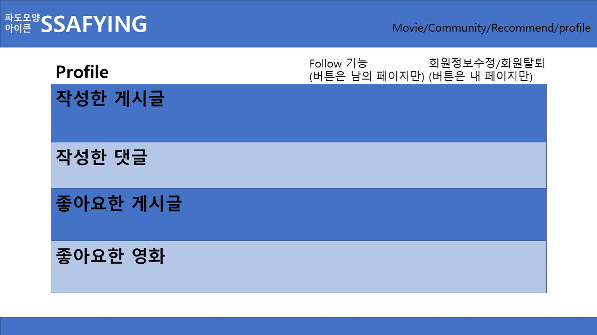
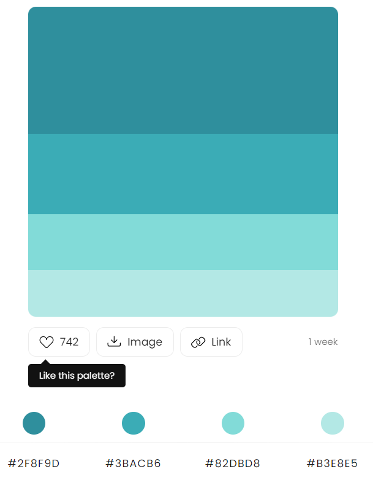
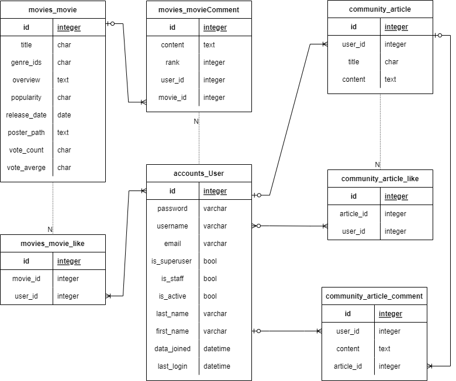

# 최종 PJT - 사용자 기반 영화 추천 사이트

## ✨영화 '성도'의 주현배우 프로젝트✨


### 🛠개발 환경

Django 3.2.12


### 🌊SSAFYING🌊

**SSAFY**의 교육생들이 만든 "영화를 **surfing**하는 웹 페이지"라는 의미를 갖는다.


### 1. 팀원 정보

팀장: [변성도](https://github.com/ppepeppe) 

팀원: [진주현](https://github.com/bonfire8)


### 1-1. 업무 분담 내역

| 날짜 | 변성도                                                       | 진주현                                                | 공통                                                         | 계획                                             |
| ---- | ------------------------------------------------------------ | ----------------------------------------------------- | ------------------------------------------------------------ | ------------------------------------------------ |
| 5/17 |                                                              |                                                       | 모델 구조, 알고리즘 구현 고민                                | 모델 구조,  알고리즘 구현 고민                   |
| 5/19 | Movie  Data 불러오기 / Movie list, detail 페이지 만들기      | 로그인페이지, 프로필 페이지, 커뮤니티 페이지 구현하기 | ERD만들기                                                    | ERD만들기 / 기본구조  만들기                     |
| 5/20 | Movie like, Movie Comment 기능 구현하기                      | Navbar 만들기, base.html / profile.html 디자인 하기   | 페이지 이름 정하기                                           | Movie 페이지 완성하기, base.html 디자인 하기     |
| 5/23 | 평점 기능 구현하기                                           | 화면 계획하기, 추천 페이지 만들기                     | 추천 알고리즘 계획하기 / 알고리즘 구현하기(좋아요한 영화의 'overview'를 기준으로 코사인유사도를 이용한 추천 알고리즘) | 화면 계획하기 / 추천 알고리즘 계획, 구성하기     |
| 5/24 | data 수정하기, movie comment 수정 기능 추가하기, movie 페이지 디자인 | profile 페이지, recomment 페이지 디자인               | 평점 기준의 추천 알고리즘 구현하기                           | 추천 알고리즘 완성하기 / recommend 페이지 디자인 |
| 5/25 |                                                              |                                                       |                                                              | movie 페이지, community 페이지 디자인            |
| 5/26 |                                                              |                                                       |                                                              | 전체적인 디자인 맞추기 / README, PPT 완성하기    |

### 2-1. URL 설정

#### pjt urls.py

```python
from django.contrib import admin
from django.urls import path, include

urlpatterns = [
    path('admin/', admin.site.urls),
    path('community/', include('community.urls')),
    path('movies/', include('movies.urls')),
    path('accounts/', include('accounts.urls')),

]
```

#### accounts urls.py

```python
from django.urls import path
from . import views

app_name = 'accounts'

urlpatterns = [
    path('login/', views.login, name='login'),
    path('logout/', views.logout, name='logout'),
    path('signup/', views.signup, name='signup'),
    path('delete/', views.delete, name='delete'),
    path('update/', views.update, name='update'),
    path('password/', views.change_password, name='change_password'),
    path('<username>/', views.profile, name='profile'),
    path('<int:user_pk>/follow/', views.follow, name='follow'),
]

```

#### community urls.py

```python
from django.urls import path
from . import views

app_name = 'community'

urlpatterns = [
    # community
    path('', views.index, name='index'),
    path('create/', views.create, name='create'), # GET / POST
    path('<int:article_pk>/', views.detail, name='detail'),
    path('<int:article_pk>/delete/', views.delete, name='delete'),
    path('<int:article_pk>/update/', views.update, name='update'), # GET / POST
    path('<int:article_pk>/like/', views.likes, name='likes'),
    
    # comments
    path('<int:article_pk>/comments/', views.comments_create, name='comments_create'),
    path('<int:article_pk>/comments/<int:comment_pk>/delete/', views.comments_delete, name='comments_delete'),
]

```

#### movies url.py
```python
from django.urls import path

from . import views

app_name = 'movies'

urlpatterns = [

  # movies
    path('', views.movie_list, name='index'),
	path('<int:movie_pk>/detail/', views.detail, name='detail'),
	path('<int:movie_pk>/comments/', views.comments_create, 		name='comments_create'),
	path('<int:movie_pk>/comments/<int:comment_pk>/delete/', views.comments_delete, name='comments_delete'),
	path('<int:movie_pk>/likes/', views.likes, name='likes'),

]
```


### 2-2. 화면 구성(계획)

#### Movie






#### Community






#### Recommend


#### Profile




#### 컬러 팔레트

파도색 비슷하게 구성 예정



### 2-3. 데이터 베이스 모델링 (ERD)

[ERD](https://viewer.diagrams.net/?tags=%7B%7D&highlight=0000ff&edit=_blank&layers=1&nav=1&title=erd.drawio#R7V1dc%2BI6Ev01ebxTlo35eJyQ7OxWzezeysytu%2FtEabAC3mssyhZJmF%2B%2FMlgyuIFYWWMZSVWpChZG4O6jPu7TlnQXTFdvXzK8Xn6jEUnufC96uwse7nwfecGY%2FytatvuWcDDaNyyyOCpPqhq%2Bx7%2BI%2BGTZuokjkh%2BdyChNWLw%2BbpzTNCVzdtSGs4y%2BHp%2F2TJPjb13jBQEN3%2Bc4ga1%2FxhFb7lvH%2Fqhq%2FzuJF0vxzWg42b%2BzwuLk8kryJY7o60FT8HgXTDNK2f7V6m1KksJ4wi77z%2F3tzLvyh2UkZU0%2BQP785Wdf%2FvHzIf%2FnPXp4pH98ftz%2BVvbygpNNecEr%2BhKTfLb7V%2F5wthXW4NewLl4y%2FLNous8ZzljptMDjDdwNDMcpyXgD2h0nCV7n8e70fcsyTqKveEs3THQkju6f4zcSPe19VpzL3feVd1YcFp0%2F886%2Flz%2BmeBsn8SLlr%2BfcAsU33mck57%2FlK85ZeQa0kbhgkjHydtBU2uwLoSvCsi0%2FpXx3WLqvxO%2BgPHytwIDGZdvyAAiBADAuAbiQPVc%2B4i9KNym4zAcuu%2BympwJ090uaxb8K5ySlMQ9dtzt%2BjVcJTjmacVRruqe70btzQZwkU5rQwr8pTQlwcXFSlNH1D5wtCCsb1jRO2c4O4T3%2F45aZep%2FCu5D%2F1ik%2FRtUx%2FytOz9iUpjnLOJSKPgj36CspvHrP6LrsNCHPov%2BstHvx%2BidljK7O%2Bv%2FiKHgfFCUKgqYouBYIAgACfvo5GPDrZzFOnnh8xOki2TttFy5x5bQTnj1pa2nfuuHro5Nycz4nu4i3jKOIpM394Tf2x4EDJor2LzurrKLcG0542Ekx4wNkk0Y5cKr8nR%2F38wD6mce6BY92ep0tQu%2F%2B3Pt8jedxuvi6%2F%2BSwhoawKzS8HfvOdHCEjgkaMYF3RSYY6maCIQABi1ly%2Ftatm%2FhAolj0939yQdjYI6YP9xHw9HyJe08EnbjessA%2FdoFfe%2BA%2FgbVuA%2F8EgGBB0ozM4hJzJgT%2FcWOvmD7khZxgT%2FRv7nvLor8PoeDCf9fhH%2Fm6478PtdtitL3E5NWY%2BC%2Bh7ghADPLDRI%2B8MYMJQMH5tjEAlH8dA3TOAKF2BoDq8JquNwnOYrY1hwOCxp4xftxDxdfwJEDB%2BbZxABR%2BHQd0zgFj7RwAVeGMJNxQZBZx%2FJnDAsPGvjF%2B5EP5tweuvioLNHe%2BZSwQwKzQsUDXLCAfVtT3OBBMCNc05%2BibrYvHEE0hAYl2RwIBzP0Ml4MUnG8ZCfiwFOhIoHMSaPxk8NVIANaFXigjszkHnu7A0GIiMGnsGdPHfQArQKbLQc2dbxkHIIgFxwGdc8BINwcgmA%2FuOADzi1jolgjaIwHU3DXGD3yY%2BhlOAgrOt4wEAqgMHk7nm9LVily4FbRoVp%2Bcnqc4rQ9Nrnb37pK4ZgSuMK8vaP4MYV8m9g1gEmfSzL7AZW%2FS0%2FCO3b65fQp4sIzLB66y03pCp84H2qf3DU7c3nP3XrqNu7VkTiLdccLAuqqOgvNtIwA3vbsHBKB9mt8APueX4fQvc6K%2Fm%2BAtTQGf5buRjKAb%2F9tGAG6adw8IQP9EvwFUBjc5yWbadaEWScBN9JaLXpwQAM0nATfZ%2BxwcXF2%2FDySgfa5fCOXAXU3PJBYIXVVfmuLEAo%2FGs4CC%2F21jAagL4vnuuc589kd%2BARQWl%2FSDxjfuo6sFbSfhtV7Tl0Phdmr6IZTwtLN2izX90Cl40hQ3q%2BC1WNNXwINtNO4UvdaTOXU%2B0F7TD6Ggt8Z5%2Fkoz3azQYi7nFD25QvOJeVk4M%2FwhbQX%2FW0YCQ6fo9YAEtNf1h1DQK6o6KV6ZM01n6AQ9aQoo6JlPAgr%2Bt40EoKDnSKBzEtBf2x9ChZCscJyYQwHNnWL8mIcyoAUU0Nz%2FtlEA1AodBXRPAdor%2B0MoCsb5LN%2BsSVYkBHdT%2F%2B6zZw4fjBp7yPgAAGXAn5Tqpv6rkkFz51tGBqIE7chAKxloX853dGJSMCcDhp%2BfjaEAiXVHASMoAhpOAQrOt40C3KYePaAA%2FWv5jk7s%2BZzP8JzFL%2BZUBiTYHQeMoARoOge4TT3OWcZt6tEHDtC%2BlO8IaoMJN9PMqOrwyG3pIU0BNUDzSwMK%2FreNBtxagH2gAe2r%2BYovO8DBc5wZxwNuTUDpcCj%2FWcADbg3Ac3CA8qDjgc55IPC08wCUBiPM8Oy%2F3NYkMoYIJNwdEYyhCFjs8cdi7bx%2FTSZQAIBtTOBmEveBCbRPJR5DgXAnDCV0EafmEIGbUSxNAZVAG4jATSE%2BZ5nLW3zMkviv88CwaDUQMelS7O%2FReIMP%2F2qh24l6zShcYTGQ8e1t8CHiiKGLgYydmCc97Tb4UMKDZUw%2BceJe6ymdOh9oXwxkArU94xZ2lFB3pDA58XTfbZBCN%2F63jQScrtcDEtC%2BGMgEynqmLfE%2BcZqeNMXNrhLYjf8t4wDkwURxTlerTRqz7axw%2FDxxml5xry60OdW522h4rcCNPJfFta7qVQPidmQ95J1YsV03e7eo61VAd%2FyNvJtN4lpU9lQQYR2ju7Su9bTuA6ygXdxDnvmJXQV2xwzIszG1U0GAdUzglnzvAxNoV%2FiQBx%2F%2FYDG7kNjfHg%2B4Jd%2BlLcQqEoeSjtmzeFTcbxsJILfkex9IQP9yvwhBubDQaYtLNYYHUHPHmD%2FyoSrIbaLb2VflAQX3W8cDUDcEhZ5Z0XIpHlhU8BmLmZeq82%2BuWPBBTtprv%2BCDbm9TR4TM3tWxArqjcYRuVtZrs%2BCjgAjrmN3JfO1neOqsoL%2Fgg6DMZ1zBBzmhT9pCSAq3xwwdIcA2JvCd1tcHJtBf8BF%2BN1nqU0jpzR%2F49kl96oqOPTTgNnjsAw30oOTjQ8FQSL0mJQW%2B2%2BixssUJadD8pEABAdaxAdQPYeHHLd2zfzcUa%2FWUMTxsuiXL9dbuQb7T99qv%2BvjNtwPsTdXHh%2FqedhZvs%2BrjO21P2kJ85%2B3ReJtVHwVE2EbrgdP62k%2Fy1FlBf9UngFqfiTle4OS%2ByhYn5vveBjl0hADryMApfn0gA%2F2FnwAKfsY9AhA4ta%2ByhZVqnwICrGOCBmIRiRZEZGjc0jHbPpEEs5imj9U7%2BzxuTwXIL8iCrZJy9JI0%2BpxlO989PnF0%2FKDfcLoV%2FFG99Ytk9Af91w4%2BWXHNRLAI%2F9ps%2B2%2FZHT%2F4T%2FHOp1AcPrwdnvkgqIa8xUx%2BjL8%2B%2BBQ%2Fqj5UHIjPQFSVNxI53WRzcsGaYRlNmeCtcycGpTJTWLZpQELeCcjIxmznkRdy9IMvwPL3gk0PdEyhW4o1yL0aFvfXXn6qwiHsqCaIDlCto71tQEftAbrB0uV9AvRv3ifPGxyjejS%2BAqx3PfxOspibeKfAX8T6uxAOUc8g7NeQJ7ZqU0VwUBsKaDLpFsHiOm4FwYoh%2BeOQG%2FctatYhN%2Flg0KxtABHWa0NXRxyUhHqNOE8NcTJaikgrI%2BYoDC7HTH7QOGS2d3sgFynpDdKDSY3WRx%2BE%2BqDWUVDv6OpYbyB99AHrH2X4NiPyu4iW66q9D%2Bmgb%2FcLo9oKnaEYnqqQHtc6GtQ7ujqkG0zz7AzSh2%2B1CGnFkP9xSE%2BaBumwbzHaH7cUo4Ox7hgNVSrdMfqGET1sen8tdbLeQHpYVxM%2BCunRQDek4VN1uiF96rbjLMreB4%2FfN%2FDUV2Tw61JUU%2FBMah2hrjWtwY2ItFWehcZHIdEbvBMUT%2BRZ3QdKscnu%2B1gXcwp7g%2FWwrfxseLX8jB9mlLLD0zO8Xn6jESnO%2BB8%3D)



