# 최종 PJT - 사용자 기반 영화 추천 사이트

## ✨영화 '성도'의 주현배우 프로젝트✨


### 🛠개발 환경

Django 3.2.12


### 🌊SSAFYING🌊

**SSAFY**의 교육생들이 만든 "영화를 **surfing**하는 웹 페이지"라는 의미를 갖는다.


### 1. 팀원 정보

팀장: [변성도](https://github.com/ppepeppe) 

팀원: [진주현](https://github.com/bonfire8)


### 1-1. 업무 분담 내역

| 날짜 | 변성도                                                   | 진주현                                                       | 공통                                                         | 계획                                             |
| ---- | -------------------------------------------------------- | ------------------------------------------------------------ | ------------------------------------------------------------ | ------------------------------------------------ |
| 5/17 |                                                          |                                                              | 모델 구조, 알고리즘 구현 고민                                | 모델 구조,  알고리즘 구현 고민                   |
| 5/19 | Movie  Data 불러오기 / Movie list, detail 페이지 만들기  | 로그인페이지, 프로필 페이지, 커뮤니티 페이지 구현하기        | ERD만들기                                                    | ERD만들기 / 기본구조  만들기                     |
| 5/20 | Movie like, Movie Comment 기능 구현하기                  | Navbar 만들기, base.html / profile.html 디자인 하기          | 페이지 이름 정하기                                           | Movie 페이지 완성하기, base.html 디자인 하기     |
| 5/23 | 평점 기능 구현하기                                       | 화면 계획하기, 추천 페이지 만들기                            | 추천 알고리즘 계획하기 / 알고리즘 구현하기(좋아요한 영화의 'overview'를 기준으로 코사인유사도를 이용한 추천 알고리즘) | 화면 계획하기 / 추천 알고리즘 계획, 구성하기     |
| 5/24 | data 수정하기,  movie index 페이지 디자인                | profile 페이지 / recomment 페이지/ community index, detail 페이지 디자인 | 평점 기준의 추천 알고리즘 구현하기, ERD 수정, community / profile 기능 수정 | 추천 알고리즘 완성하기 / recommend 페이지 디자인 |
| 5/25 | movie detail 페이지 디자인, movie comment 수정 기능 구현 | community 페이지 완성하기, movie index 페이지 디자인         |                                                              | movie 페이지 완성하기, community 페이지 완성하기 |
| 5/26 | movie detail 페이지 완성                                 | movie index 페이지 완성                                      | 전체적인 디자인 완성 / README, PPT 작성                      | 전체적인 디자인 맞추기 / README, PPT 완성하기    |

### 2-1. URL 설정

#### pjt urls.py

```python
from django.contrib import admin
from django.urls import path, include

urlpatterns = [
    path('admin/', admin.site.urls),
    path('community/', include('community.urls')),
    path('movies/', include('movies.urls')),
    path('accounts/', include('accounts.urls')),

]
```

#### accounts urls.py

```python
from django.urls import path
from . import views

app_name = 'accounts'

urlpatterns = [
    path('login/', views.login, name='login'),
    path('logout/', views.logout, name='logout'),
    path('signup/', views.signup, name='signup'),
    path('delete/', views.delete, name='delete'),
    path('update/', views.update, name='update'),
    path('password/', views.change_password, name='change_password'),
    path('<username>/', views.profile, name='profile'),
    path('<int:user_pk>/follow/', views.follow, name='follow'),
]

```

#### community urls.py

```python
from django.urls import path
from . import views

app_name = 'community'

urlpatterns = [
    # community
    path('', views.index, name='index'),
    path('create/', views.create, name='create'), # GET / POST
    path('<int:article_pk>/', views.detail, name='detail'),
    path('<int:article_pk>/delete/', views.delete, name='delete'),
    path('<int:article_pk>/update/', views.update, name='update'), # GET / POST
    path('<int:article_pk>/like/', views.likes, name='likes'),
    
    # comments
    path('<int:article_pk>/comments/', views.comments_create, name='comments_create'),
    path('<int:article_pk>/comments/<int:comment_pk>/delete/', views.comments_delete, name='comments_delete'),
]

```

#### movies url.py
```python
from django.urls import path
from . import views

app_name = 'movies'

urlpatterns = [
    # movies
    path('', views.movie_list, name='index'),
    path('<int:movie_pk>/detail/', views.detail, name='detail'),
    path('<int:movie_pk>/comments/', views.comments_create, name='comments_create'),
    path('<int:movie_pk>/comments/<int:comment_pk>/delete/', views.comments_delete, name='comments_delete'),
    path('<int:movie_pk>/likes/', views.likes, name='likes'),
    path('recommend/<username>/' ,views.recommend, name='recommend'),
    path('<int:movie_pk>/unlikes/', views.unlikes, name='unlikes'),
    path('<int:movie_pk>/comments/<int:comment_pk>/update/', views.comments_update, name='comments_update'),


]

```


### 2-2. 화면 구성(계획)

#### Movie


#### Community


#### Recommend

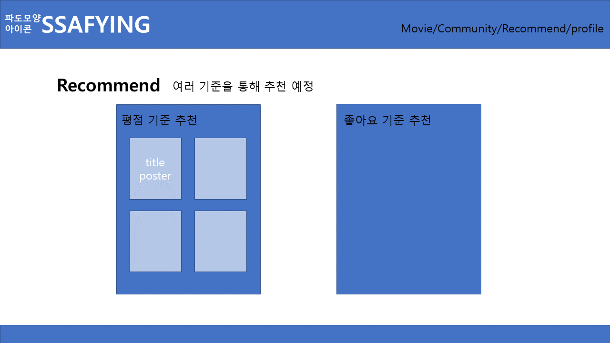


#### Profile


#### 컬러 팔레트

파도색 비슷하게 구성

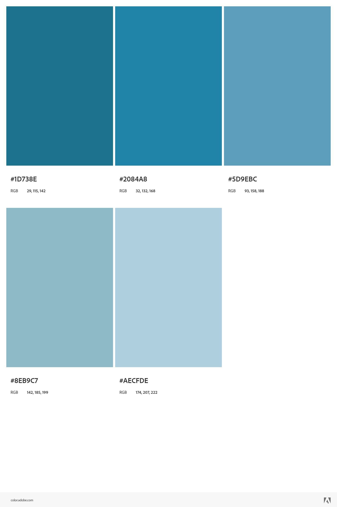


### 2-3. 데이터 베이스 모델링 (ERD)

[ERD](https://viewer.diagrams.net/?tags=%7B%7D&highlight=0000ff&edit=_blank&layers=1&nav=1&title=erd.drawio#R7V1dc%2BI6Ev01ebxTlo35eJyQ7OxWzezeysytu%2FtEabAC3mssyhZJmF%2B%2FMlgyuIFYWWMZSVWpChZG4O6jPu7TlnQXTFdvXzK8Xn6jEUnufC96uwse7nwfecGY%2FytatvuWcDDaNyyyOCpPqhq%2Bx7%2BI%2BGTZuokjkh%2BdyChNWLw%2BbpzTNCVzdtSGs4y%2BHp%2F2TJPjb13jBQEN3%2Bc4ga1%2FxhFb7lvH%2Fqhq%2FzuJF0vxzWg42b%2BzwuLk8kryJY7o60FT8HgXTDNK2f7V6m1KksJ4wi77z%2F3tzLvyh2UkZU0%2BQP785Wdf%2FvHzIf%2FnPXp4pH98ftz%2BVvbygpNNecEr%2BhKTfLb7V%2F5wthXW4NewLl4y%2FLNous8ZzljptMDjDdwNDMcpyXgD2h0nCV7n8e70fcsyTqKveEs3THQkju6f4zcSPe19VpzL3feVd1YcFp0%2F886%2Flz%2BmeBsn8SLlr%2BfcAsU33mck57%2FlK85ZeQa0kbhgkjHydtBU2uwLoSvCsi0%2FpXx3WLqvxO%2BgPHytwIDGZdvyAAiBADAuAbiQPVc%2B4i9KNym4zAcuu%2BympwJ090uaxb8K5ySlMQ9dtzt%2BjVcJTjmacVRruqe70btzQZwkU5rQwr8pTQlwcXFSlNH1D5wtCCsb1jRO2c4O4T3%2F45aZep%2FCu5D%2F1ik%2FRtUx%2FytOz9iUpjnLOJSKPgj36CspvHrP6LrsNCHPov%2BstHvx%2BidljK7O%2Bv%2FiKHgfFCUKgqYouBYIAgACfvo5GPDrZzFOnnh8xOki2TttFy5x5bQTnj1pa2nfuuHro5Nycz4nu4i3jKOIpM394Tf2x4EDJor2LzurrKLcG0542Ekx4wNkk0Y5cKr8nR%2F38wD6mce6BY92ep0tQu%2F%2B3Pt8jedxuvi6%2F%2BSwhoawKzS8HfvOdHCEjgkaMYF3RSYY6maCIQABi1ly%2Ftatm%2FhAolj0939yQdjYI6YP9xHw9HyJe08EnbjessA%2FdoFfe%2BA%2FgbVuA%2F8EgGBB0ozM4hJzJgT%2FcWOvmD7khZxgT%2FRv7nvLor8PoeDCf9fhH%2Fm6478PtdtitL3E5NWY%2BC%2Bh7ghADPLDRI%2B8MYMJQMH5tjEAlH8dA3TOAKF2BoDq8JquNwnOYrY1hwOCxp4xftxDxdfwJEDB%2BbZxABR%2BHQd0zgFj7RwAVeGMJNxQZBZx%2FJnDAsPGvjF%2B5EP5tweuvioLNHe%2BZSwQwKzQsUDXLCAfVtT3OBBMCNc05%2BibrYvHEE0hAYl2RwIBzP0Ml4MUnG8ZCfiwFOhIoHMSaPxk8NVIANaFXigjszkHnu7A0GIiMGnsGdPHfQArQKbLQc2dbxkHIIgFxwGdc8BINwcgmA%2FuOADzi1jolgjaIwHU3DXGD3yY%2BhlOAgrOt4wEAqgMHk7nm9LVily4FbRoVp%2Bcnqc4rQ9Nrnb37pK4ZgSuMK8vaP4MYV8m9g1gEmfSzL7AZW%2FS0%2FCO3b65fQp4sIzLB66y03pCp84H2qf3DU7c3nP3XrqNu7VkTiLdccLAuqqOgvNtIwA3vbsHBKB9mt8APueX4fQvc6K%2Fm%2BAtTQGf5buRjKAb%2F9tGAG6adw8IQP9EvwFUBjc5yWbadaEWScBN9JaLXpwQAM0nATfZ%2BxwcXF2%2FDySgfa5fCOXAXU3PJBYIXVVfmuLEAo%2FGs4CC%2F21jAagL4vnuuc589kd%2BARQWl%2FSDxjfuo6sFbSfhtV7Tl0Phdmr6IZTwtLN2izX90Cl40hQ3q%2BC1WNNXwINtNO4UvdaTOXU%2B0F7TD6Ggt8Z5%2Fkoz3azQYi7nFD25QvOJeVk4M%2FwhbQX%2FW0YCQ6fo9YAEtNf1h1DQK6o6KV6ZM01n6AQ9aQoo6JlPAgr%2Bt40EoKDnSKBzEtBf2x9ChZCscJyYQwHNnWL8mIcyoAUU0Nz%2FtlEA1AodBXRPAdor%2B0MoCsb5LN%2BsSVYkBHdT%2F%2B6zZw4fjBp7yPgAAGXAn5Tqpv6rkkFz51tGBqIE7chAKxloX853dGJSMCcDhp%2BfjaEAiXVHASMoAhpOAQrOt40C3KYePaAA%2FWv5jk7s%2BZzP8JzFL%2BZUBiTYHQeMoARoOge4TT3OWcZt6tEHDtC%2BlO8IaoMJN9PMqOrwyG3pIU0BNUDzSwMK%2FreNBtxagH2gAe2r%2BYovO8DBc5wZxwNuTUDpcCj%2FWcADbg3Ac3CA8qDjgc55IPC08wCUBiPM8Oy%2F3NYkMoYIJNwdEYyhCFjs8cdi7bx%2FTSZQAIBtTOBmEveBCbRPJR5DgXAnDCV0EafmEIGbUSxNAZVAG4jATSE%2BZ5nLW3zMkviv88CwaDUQMelS7O%2FReIMP%2F2qh24l6zShcYTGQ8e1t8CHiiKGLgYydmCc97Tb4UMKDZUw%2BceJe6ymdOh9oXwxkArU94xZ2lFB3pDA58XTfbZBCN%2F63jQScrtcDEtC%2BGMgEynqmLfE%2BcZqeNMXNrhLYjf8t4wDkwURxTlerTRqz7axw%2FDxxml5xry60OdW522h4rcCNPJfFta7qVQPidmQ95J1YsV03e7eo61VAd%2FyNvJtN4lpU9lQQYR2ju7Su9bTuA6ygXdxDnvmJXQV2xwzIszG1U0GAdUzglnzvAxNoV%2FiQBx%2F%2FYDG7kNjfHg%2B4Jd%2BlLcQqEoeSjtmzeFTcbxsJILfkex9IQP9yvwhBubDQaYtLNYYHUHPHmD%2FyoSrIbaLb2VflAQX3W8cDUDcEhZ5Z0XIpHlhU8BmLmZeq82%2BuWPBBTtprv%2BCDbm9TR4TM3tWxArqjcYRuVtZrs%2BCjgAjrmN3JfO1neOqsoL%2Fgg6DMZ1zBBzmhT9pCSAq3xwwdIcA2JvCd1tcHJtBf8BF%2BN1nqU0jpzR%2F49kl96oqOPTTgNnjsAw30oOTjQ8FQSL0mJQW%2B2%2BixssUJadD8pEABAdaxAdQPYeHHLd2zfzcUa%2FWUMTxsuiXL9dbuQb7T99qv%2BvjNtwPsTdXHh%2FqedhZvs%2BrjO21P2kJ85%2B3ReJtVHwVE2EbrgdP62k%2Fy1FlBf9UngFqfiTle4OS%2ByhYn5vveBjl0hADryMApfn0gA%2F2FnwAKfsY9AhA4ta%2ByhZVqnwICrGOCBmIRiRZEZGjc0jHbPpEEs5imj9U7%2BzxuTwXIL8iCrZJy9JI0%2BpxlO989PnF0%2FKDfcLoV%2FFG99Ytk9Af91w4%2BWXHNRLAI%2F9ps%2B2%2FZHT%2F4T%2FHOp1AcPrwdnvkgqIa8xUx%2BjL8%2B%2BBQ%2Fqj5UHIjPQFSVNxI53WRzcsGaYRlNmeCtcycGpTJTWLZpQELeCcjIxmznkRdy9IMvwPL3gk0PdEyhW4o1yL0aFvfXXn6qwiHsqCaIDlCto71tQEftAbrB0uV9AvRv3ifPGxyjejS%2BAqx3PfxOspibeKfAX8T6uxAOUc8g7NeQJ7ZqU0VwUBsKaDLpFsHiOm4FwYoh%2BeOQG%2FctatYhN%2Flg0KxtABHWa0NXRxyUhHqNOE8NcTJaikgrI%2BYoDC7HTH7QOGS2d3sgFynpDdKDSY3WRx%2BE%2BqDWUVDv6OpYbyB99AHrH2X4NiPyu4iW66q9D%2Bmgb%2FcLo9oKnaEYnqqQHtc6GtQ7ujqkG0zz7AzSh2%2B1CGnFkP9xSE%2BaBumwbzHaH7cUo4Ox7hgNVSrdMfqGET1sen8tdbLeQHpYVxM%2BCunRQDek4VN1uiF96rbjLMreB4%2FfN%2FDUV2Tw61JUU%2FBMah2hrjWtwY2ItFWehcZHIdEbvBMUT%2BRZ3QdKscnu%2B1gXcwp7g%2FWwrfxseLX8jB9mlLLD0zO8Xn6jESnO%2BB8%3D)


### 실제 구현 정도

#### navbar


- 그리드 시스템을 이용하여 반응형 웹으로 제작하였습니다

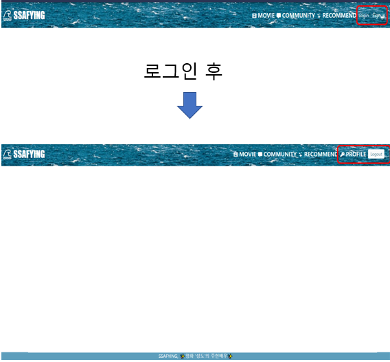

- 로그인 전에는 로그인 기능과 회원가입 기능을 Nav바에서 보여주고 로그인 후에는 프로필 기능과 로그아웃 기능을 보여주게 하였습니다.

#### 1. 로그인 회원가입 페이지

#### 2. 영화 목록 페이지

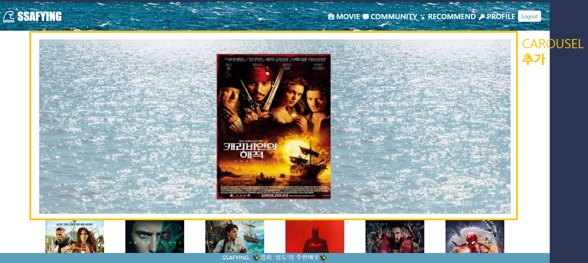

- 영화 목록페이지에서 사용자의 편의를 위해 버튼식으로 넘기면서 영화목록을 확인 할 수 있게끔 carousel을 이용하여 영화목록을 보여주었습니다.

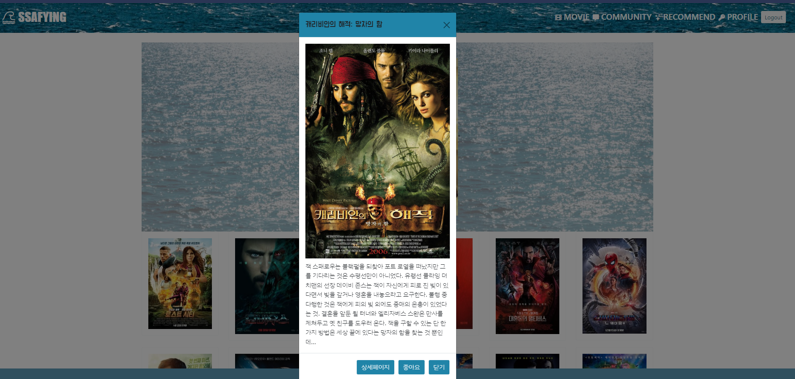

- 목록에서 원하는 영화 발견 시 모달 화면을 띄워줍니다.
- __modal 기능__
- 영화 제목, 포스터, 줄거리
- 상세페이지, 좋아요, 닫기 기능

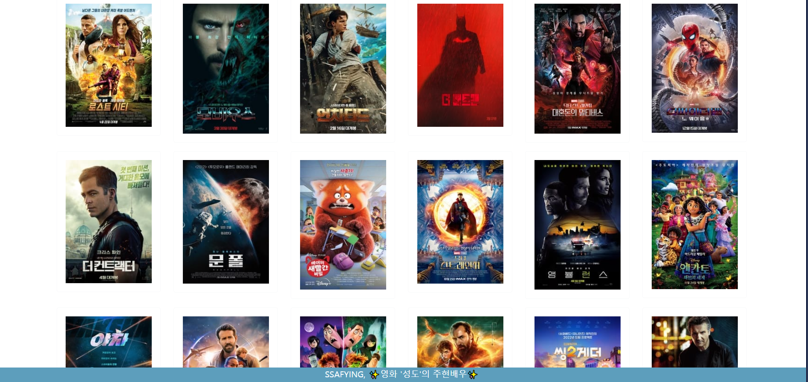

- TMDB 영화데이터 200개를 보여줍니다.

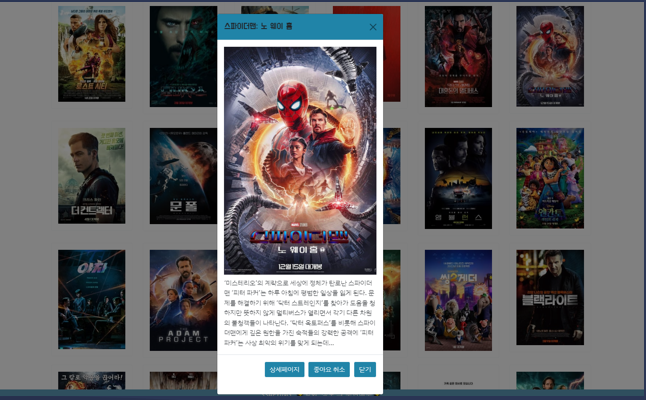

- 목록에서 원하는 영화 발견 시 모달 화면을 띄워줍니다.
- __modal 기능__
- 영화 제목, 포스터, 줄거리
- 상세페이지, 좋아요, 닫기 기능

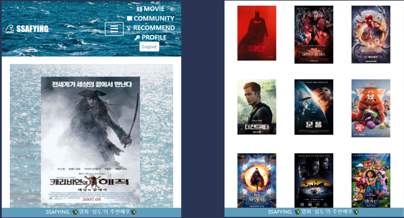

- 또한 화면 크기에 맞게 그리드 시스템을 이용해 반응형 웹으로 제작하였습니다.

#### 3. 영화 디테일 페이지
- 영화 디테일 페이지에서는 영화의 상세정보를 보여줍니다.
- __detaill 페이지 기능__
- 좋아요 기능 (하트를 클릭하는 방식, 좋아요한 인원수도 출력)
- 평점 기능(1점~5점 까지 평점 선택 방식, 본인이 작성한 평점만 삭제 or 수정 가능, 로그인 후 이용가능)

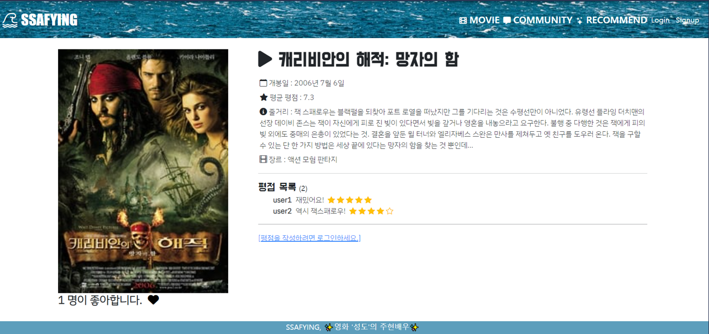

- 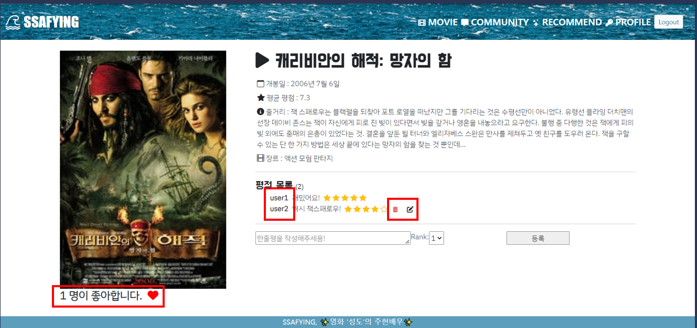


#### 4. 커뮤니티 페이지

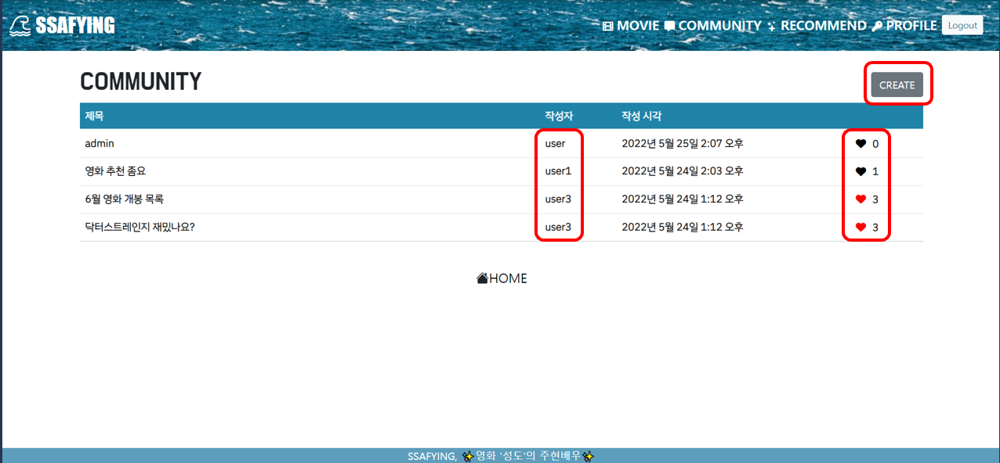

- community 페이지 입니다.

- community에는영화 정보와 관련된 소통을 할 수 있는 커뮤니티 기능을 구현했습니다.
- 기본 페이지에는 모든 글의 제목과 작성자, 작성 시각과 좋아요 기능을 보여줬습니다.
- 또한 추가 작성을 위한 create버튼을 보여 줍니다. 이 기능은 로그인 된 후에 가능합니다.
- 작성글의 제목을 클릭하면 해당 작성글로 들어갈 수 있습니다.

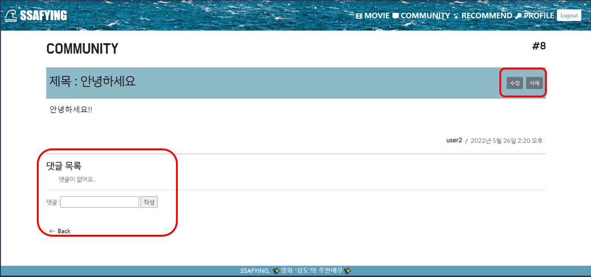

- 작성글 상세 페이지입니다. 
- 작성글의 상세 내용과 댓글을 입력 할 수 있는 기능을 구현했습니다.
- 또한 작성자는 수정과, 삭제를 할 수 있는 기능도 구현하였습니다.

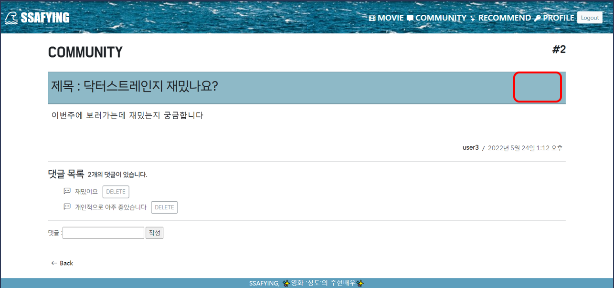

- 작성자가 아닐 시 수정, 삭제 기능이 보이지 않습니다. 
- 댓글 역시 작성자만 삭제 할 수 있어 댓글 삭제 버튼이 보입니다.

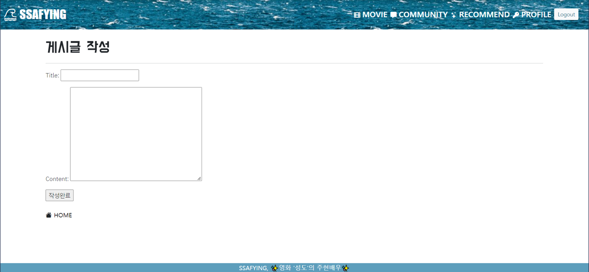

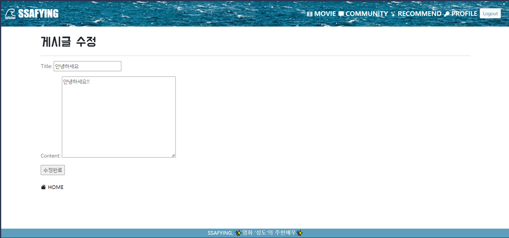

- 게시글은 다음과 같이 생성, 수정 할 수 있습니다.

#### 5. 추천 페이지

- 추천 알고리즘은 코사인 유사도를 이용한 추천 기능을 구현했습니다.

- __코사인유사도__

  - 두 벡터가 가르키는 방향이 얼마나 유사한가를 이용하여 벡터의 방향이 완전히 일치하면 1
  - TF-IDF 행렬을 통해서 문서의 유사도를 구하는 경우 TF-IDF 행렬이 각각의 특징 벡터가 되어 코사인 유사도로 문서의 유사도를 파악
  - 줄거리를 이용한 추천 알고리즘 구현

- 좋아요한 영화와 평점을 입력한 영화를 이용하여 진행했습니다.

- 좋아요는 좋아요한 영화 중 랜덤으로 골라 그 영화와 줄거리가 유사한 순서대로 5개의 영화를 추천해주는 방식입니다.

- 평점은 입력한 평점중 평점이 가장 높은 영화들 중 랜덤으로 하나를 골라 그 영화와 줄거리가 유사한 순서대로 5개의 영화를 추천해 주는 방식입니다.

  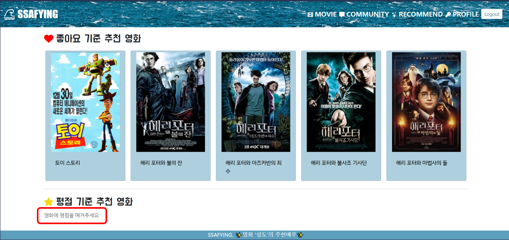

  - 평점을 입력 안했을 시 평점을 입력해달라고 사용자에게 알려줍니다.

  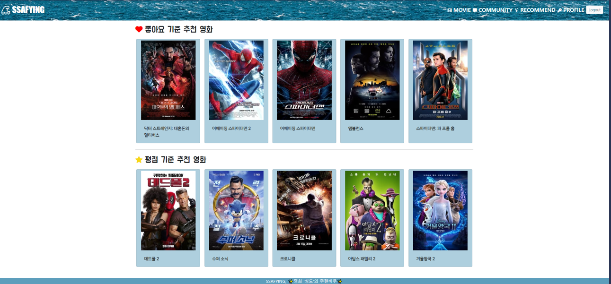

  


#### 6. 프로필 페이지

- 프로필 페이지에서는 사용자가 입력한 영화에 대한 한줄평, 작성한 게시글, 게시글에 작성한 댓글, 좋아요한 게시글, 영화를 보여줍니다. 또한 사용자간의 팔로우 기능도 추가 하였습니다.  

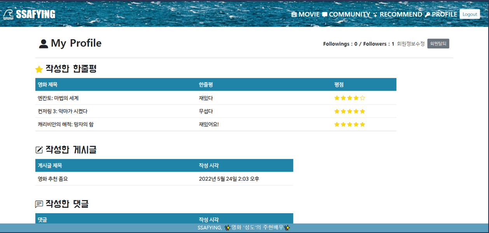

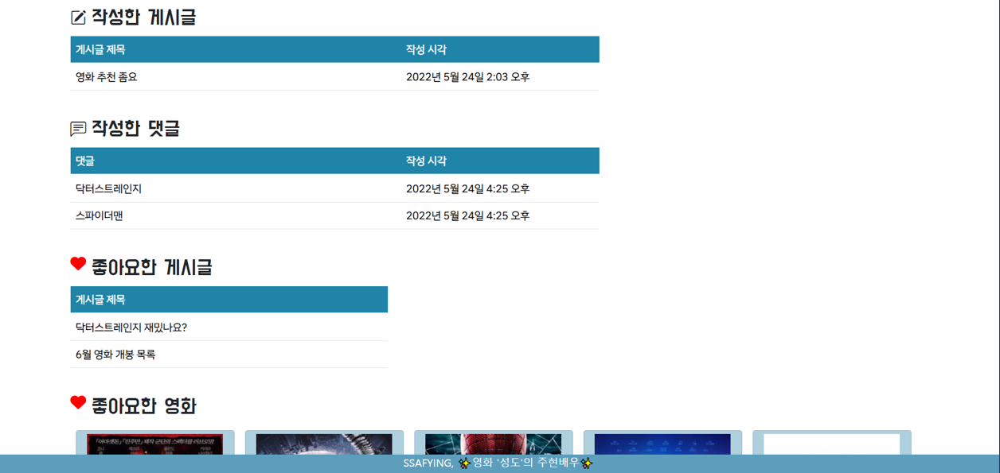

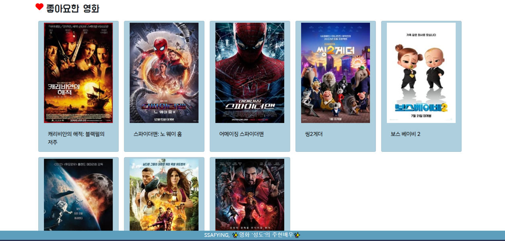


#### 느낀점

__변성도__

```
저희는 백엔드와 프로트앤드를 나누지 않고 기능을 나눠서 진행했습니다.
프로젝트를 진행하면서 서로가 두 부분을 다 하다 보니 서로가 아는 것을 공유해주면서
진행할 수 있어서 아직 초보입장인 저희에게는 더 효율적인 방법이였지 않나 싶습니다.
초기 기획에 시간을 많이 투자해도 고칠 부분이 있었습니다.
완벽한 기획은 없을것이라는 생각을 하게되었고 그때 그때 고치면서 그래도 다음번에 할 실수를 
미리 경험한거 같습니다. 
기능을 구현하면 좀만 더 하면 더 좋은 기능이 될거 같다는 생각을 하게 되어 진짜 배움에는 끝이 
없다는 것을 느꼈습니다. 특히 추천알고리즘을 구현할때 모델이 원하는 데이터를 DB에서 직접뽑아
내면서 진행했던 과정이 제일 기억에 남습니다. 전체적인 과정을 돌아 볼 수 있어서 좋았고 이와 비
슷한 토이 프로젝트를 한번더 해봐야겠다는 생각을 하게 되었습니다. 또한 일의 능률이 뛰어난 팀
원을 만나 빨리 원하는 기능과 디자인을 구현할 수 있어서 너무 좋았습니다.
```

```
백엔드 보다 프론트엔드가 어려웠습니다. 그리고 프론트엔드가 사실 사용자가 접하는 곳이
기 때문에 어떻게 하면 더 이쁠까 하는 욕심이 자꾸 들었는데 잘 해내지 못해 너무 아쉽
고 어려웠습니다. 
그래도 주현님이 잘해주셔서 이쁘고 만족할 만한 페이지가 나온거 같습니다.

```


__진주현__

```
처음 기획했던 것과 많은 것이 달라지진 않았지만 그래도 아이디어를 계속  추가하다보니 모델을 수정하게 되는 경우가 많았습니다. 
처음부터 확실하게 정해놓고 가면 좋았겠지만 구현을 하면 할수록 이 기능이 있으면 좋겠다라는 생각에 욕심을 부렸던 것 같습니다. 
역할을 잘 정해 분업이 잘 되었고 개인의 기량들이 어느정도 있어 서로에게 부족한 부분을 채워주니 실제 완성까지 오래걸리진 않았습니다.
프로젝트를 진행한 일주일동안 팀장님과 잘 맞아서 큰 트러블 없이 무사히 마쳤습니다.
```
```
기능을 구현하는 것보다는 디자인 부분에서 어려웠던 점이 많았습니다. 처음에는 기본만
하자!라는 생각이 하다보니 욕심이 생겨 디자인까지 잘하고 싶었습니다. 그래서 CSS에 대
해 공부를 많이 했습니다.
가장 어려웠던 부분은 carousel을 만드는 부분이었습니다. 기본 구조를 수정하고 싶어
이것저것 손을 대다 원하는 모양의 carousel을 구현하기 힘들었습니다.
그래서 처음부터 다시 시작하자는 생각으로 새로 구현하니 원하는 디자인이 나왔습니다.
디자인의 길은 다양하고도 넓다고 생각했습니다. 
보여지는 부분도 매우 중요하다고 생각해 앞으로 공부를 많이 해야겠다고 느꼈습니다
```